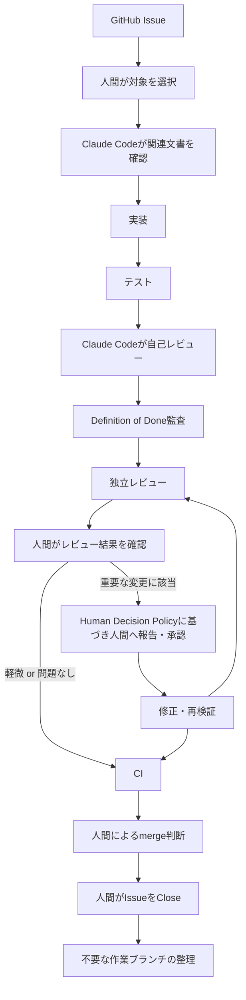

# ai-native-sdlc-training

**AI Coding Agent をソフトウェア開発ライフサイクル（SDLC）全体に組み込み、人間の判断と AI の実行・レビューを組み合わせて開発を進める、AI ネイティブ開発の実践・教材化プロジェクトです。**

題材として中小企業向けの「案件・見積・作業・請求管理システム」を開発していますが、このシステムの完成自体が目的ではありません。目的は、ヒアリングから振り返りまでの SDLC 全工程に AI Coding Agent（Claude Code）をどう組み込み、どこを AI に任せ、どこを人間が判断するかを実践し、企業研修・AI 駆動開発研修として展開できる形にすることです。

---

## 目次

- [このプロジェクトについて](#このプロジェクトについて)
- [なぜ AI ネイティブ SDLC なのか](#なぜai-ネイティブ-sdlc-なのか)
- [AI ネイティブ SDLC 全体像](#ai-ネイティブ-sdlc-全体像)
- [人間と AI の役割分担](#人間と-ai-の役割分担)
- [Human Decision Policy](#human-decision-policy)
- [Issue 単位の AI 駆動開発サイクル](#issue-単位の-ai-駆動開発サイクル)
- [実践例：Issue #1](#実践例issue-1)
- [題材となる業務システム](#題材となる業務システム)
- [ドキュメント体系](#ドキュメント体系)
- [技術スタック](#技術スタック)
- [現在の実装状況](#現在の実装状況)
- [ロードマップ](#ロードマップ)
- [ローカルセットアップ](#ローカルセットアップ)
- [このプロジェクトで検証したいこと](#このプロジェクトで検証したいこと)

---

## このプロジェクトについて

このリポジトリは、「AI に業務システムを作らせてみた」というデモではありません。

`docs/` 配下には、初回ヒアリングから詳細設計までの上流工程ドキュメントが合計9本・約9,000行以上蓄積されており、Git のコミット履歴を見ると、最初の9コミットはすべてこの上流ドキュメントで、実装（Spring Boot の初期構築）が登場するのはその後です。つまり「思いついたらすぐコーディング」ではなく、業務理解・要件定義・設計を積み上げてから実装に入るという、通常のSDLCの順序を AI Coding Agent との協働の中で実際に踏んでいます。

対象読者として、生成AI研修・AI駆動開発研修を検討する企業、AIコンサルティング企業、IT研修会社、採用・業務委託の担当者、AI Coding Agent の導入を検討するエンジニア・講師の方を想定しています。

## なぜAI ネイティブ SDLC なのか

生成AIによるコーディング支援は珍しくなくなりましたが、多くの事例は「実装」の工程だけを対象にしています。このプロジェクトでは、

- ヒアリング・業務分析・要件定義・設計といった上流工程
- 実装・テストといった開発工程
- 自己レビュー・Definition of Done 監査・独立レビューといった品質保証工程
- CI/CD・デプロイ・振り返りといった運用工程

の全体に AI Coding Agent を関与させつつ、**どこで人間が意思決定するか**を `CLAUDE.md` に明文化し、実際に運用しています。AI に「全部お任せ」にするのではなく、AI の自律性と人間のガバナンスのバランスを設計・検証すること自体が、このプロジェクトの研修教材としての価値です。

## AI ネイティブ SDLC 全体像


「完了」はドキュメント・工程として実際に成果物が存在するもの、「未着手」は方針・設計は決まっているが実体がまだ存在しないものを指します（詳細は[現在の実装状況](#現在の実装状況)を参照してください）。

## 人間と AI の役割分担

`CLAUDE.md` では、AI に業務仕様をすべて委ねる方針を採っていません。

| 人間 | AI（Claude Code） |
| --- | --- |
| 業務理解・目的設定 | 関連ドキュメント・Issue の確認 |
| 要件・設計上の重要判断 | 実装 |
| スコープ判断 | テスト作成・実行 |
| AI へのコンテキスト提供 | 自己レビュー |
| 重要な修正の承認 | Definition of Done 監査 |
| 最終レビュー・merge 判断 | 修正案の提示、承認後の修正・再検証 |

Claude Code は「実装を担当する AI エンジニア」という位置づけで、業務要件・設計・スコープに関する最終判断は行いません。

## Human Decision Policy

`CLAUDE.md` の Human Decision Policy では、以下のようなケースで AI が独自判断せず人間へ確認することを定めています。

- 要件が未定義・複数の解釈が可能・ドキュメント間に矛盾がある
- 業務ルールや MVP スコープの変更が必要になる
- セキュリティ・権限に関する重要な判断が必要になる
- データモデルや設計（アーキテクチャ・技術構成）に大きな影響がある変更が必要になる
- 依存関係（ライブラリ・フレームワーク）の追加・削除・重要な変更が必要になる
- Issue のスコープや Definition of Done に影響する変更が必要になる

これは「実装後の監査や独立レビューで問題が見つかった場合」にも適用され、AI がその場で独断修正するのではなく、人間へ報告して承認を得てから修正する運用です（実例は[実践例：Issue #1](#実践例issue-1)を参照）。

## Issue 単位の AI 駆動開発サイクル



重要な仕様変更・設計変更・依存関係変更などが発生した場合は、この図の通り一度人間の判断に差し戻ります。一方、既存の仕様・設計・スコープに影響しない軽微な修正まで毎回このループを回すことは求めていません（`CLAUDE.md` の AI Coding Workflow / Human Decision Policy 参照）。

## 実践例：Issue #1

Issue #1「chore: initialize Spring Boot application」（Spring Boot アプリケーションの初期構築）で、実際に上記サイクルが機能した例を紹介します。技術的な詳細（Flyway の依存関係の話）そのものより、プロセスが実際に回ったことが重要です。

1. Claude Code が Spring Boot の初期構成を実装
2. ビルド・テストを実行
3. Definition of Done を項目ごとに監査
4. 依存関係上は存在するが、実際には自動設定が有効になっていない設定不備を検出
5. 内容を人間へ報告
6. 人間が修正方針を承認
7. Claude Code が原因を調査した上で最小限の修正を実施
8. 起動・DB接続・マイグレーション実行を再検証
9. 別の独立レビューで、依存関係の冗長な宣言を指摘
10. 人間へ報告し、承認を得て修正
11. 再度、ビルド・起動・DB接続・マイグレーションを再検証
12. Pull Request を作成
13. 人間が最終確認して merge
14. Issue を Close し、作業ブランチを整理
15. この経験を踏まえて `CLAUDE.md` の開発ルール自体を更新

「AI が一度コードを書いて終わり」ではなく、**実装 → 監査 → 問題発見 → 人間判断 → 修正 → 独立レビュー → 人間判断 → 再修正 → 再検証** というループを、実際に1サイクル回し切った例です。

## 題材となる業務システム

題材は中小企業向けの「案件・見積・作業・請求管理システム」です。現行業務では、営業・作業部門・経理がそれぞれ Excel やメールで案件情報を管理しており、情報が分散し、部門間の引き継ぎが担当者依存になっているという課題があります。これに対し、「案件」を中心に営業・作業部門・経理が共通の情報を参照できる状態を目指します。

MVP で想定している主要な業務フローは以下の通りです（`CLAUDE.md` MVP Scope より）。

```
ログイン → 顧客登録 → 案件登録 → 見積作成 → （必要な場合）見積承認 → 見積提出
→ 受注 → 作業部門への引き継ぎ → 作業担当者割り当て → 作業 → 納品
→ 請求 → 入金確認 → 案件完了
```

業務システムの詳細は `docs/07_requirements_definition.md` 以降を参照してください。

## ドキュメント体系

`docs/` 配下には、SDLC の各段階に対応するドキュメントが揃っています。

| ファイル | 段階 | 内容 |
| --- | --- | --- |
| `docs/01_initial_hearing.md` | ヒアリング | 初回ヒアリング記録 |
| `docs/02_hearing_retrospective.md` | ヒアリング振り返り | ヒアリングの質を振り返り、改善点を言語化 |
| `docs/03_as_is_business_flow.md` | As-Is 分析 | 現行業務フロー |
| `docs/04_business_issues_analysis.md` | 課題分析 | 業務課題の整理 |
| `docs/05_to_be_business_flow.md` | To-Be 設計 | 将来業務フロー |
| `docs/06_system_scope_and_mvp.md` | スコープ / MVP 検討 | システム化範囲・MVP の初期検討 |
| `docs/07_requirements_definition.md` | 要件定義 | 機能要件・業務ルール・データ要件等 |
| `docs/08_basic_design.md` | 基本設計 | システム構成・画面・データモデル等 |
| `docs/09_detailed_design.md` | 詳細設計 | Entity・Service・API・テスト方針等 |

> **注記**：`docs/06_system_scope_and_mvp.md` はスコープ検討時点（上流工程）の文書です。その後の要件定義・基本設計・詳細設計（07〜09）で MVP の範囲や業務ルールがより具体的に確定・修正されているため、最終的な仕様は 07 以降および `CLAUDE.md` を正としてください。

`CLAUDE.md` には、これらのドキュメントを実装時にどの優先順位で参照するか、および矛盾があった場合に独自判断せず人間へ確認するルールが明記されています。

## 技術スタック

`pom.xml` および設定ファイルで実際に採用が確認できる技術です。

- Java 25 (LTS)
- Spring Boot 4.1.1
- Spring MVC（spring-boot-starter-web）
- Thymeleaf（spring-boot-starter-thymeleaf）
- Spring Security（spring-boot-starter-security）
- Spring Data JPA / Hibernate（spring-boot-starter-data-jpa）
- Bean Validation（spring-boot-starter-validation）
- Flyway（spring-boot-starter-flyway + flyway-database-postgresql）
- PostgreSQL 18（ドライバ：org.postgresql:postgresql）
- Maven Wrapper（`mvnw` / `mvnw.cmd`）
- JUnit 5 / Mockito / Spring Boot Test（spring-boot-starter-test）
- Docker / Docker Compose（ローカル PostgreSQL 用）
- Git / GitHub

GitHub Actions による CI、Render へのデプロイは `CLAUDE.md` に方針として記載されていますが、現時点でリポジトリ上に実体（ワークフローファイル等）は存在しません。[ロードマップ](#ロードマップ)を参照してください。

## 現在の実装状況

**実装済み**

- Spring Boot 4.1.1 / Java 25 のプロジェクト基盤（`pom.xml`、Maven Wrapper）
- アプリケーションのメインクラス（`SalesManagementApplication`）
- PostgreSQL 18 / Spring Data JPA / Flyway の疎通が確認済みの基盤（ビルド・起動・DB接続・マイグレーション実行まで確認済み）
- 基本パッケージ構成（`com.example.salesmanagement` 配下の `auth / user / customer / project / quotation / work / delivery / invoice / payment / common` の10パッケージを `package-info.java` として実体化し、Git 管理下に配置済み）
- コンテキストロードテスト 1 件

**設計済みだが未実装**

- 業務機能（ユーザー・顧客・案件・見積・見積承認・作業引き継ぎ・作業担当・納品・請求・入金の各 Entity / Repository / Service / Controller）
- 画面（Thymeleaf テンプレートは未作成）
- 認証・認可の具体的な設定（現状は Spring Security のデフォルト設定のみ）

**今後の予定（方針のみ、未着手）**

- GitHub Actions による CI パイプライン
- Render への実デプロイ

## ロードマップ

1. 業務機能の実装（MVP の業務フロー順：ユーザー・顧客管理 → 案件管理 → 見積・承認 → 作業引き継ぎ・進捗管理 → 納品 → 請求・入金）
2. 各機能に対応する自動テスト（単体・Repository・Controller/MVC・権限・統合テスト）の整備
3. GitHub Actions による CI パイプラインの構築
4. Render への実デプロイ
5. MVP End-to-End シナリオ（ログイン〜案件完了）の一気通貫での動作確認

## ローカルセットアップ

現在の `docker-compose.yml` / `application.yml` に基づく、確認可能な範囲での手順です（業務機能はまだ実装されていないため、起動確認とテスト実行が中心になります）。

```bash
# 1. ローカル PostgreSQL を起動
docker compose up -d

# 2. ビルド・テスト（Maven Wrapper を使用）
./mvnw clean verify

# 3. アプリケーションを起動
./mvnw spring-boot:run
```

**データベース接続について**

ローカル開発では、PostgreSQL のホスト側ポートとして 5433（コンテナ内部は5432）を使用します。`application.yml` のデフォルト接続先もこれに合わせて `localhost:5433` になっています。

接続情報は環境変数で上書き可能です（`application.yml` より）。

| 環境変数 | デフォルト値 |
| --- | --- |
| `DB_HOST` | `localhost` |
| `DB_PORT` | `5433` |
| `DB_NAME` | `salesmanagement` |
| `DB_USERNAME` | `salesmanagement` |
| `DB_PASSWORD` | `salesmanagement` |

## このプロジェクトで検証したいこと

- AI Coding Agent を実装だけでなく SDLC 全体（上流工程・品質保証・運用）に組み込めるか
- 「AI に委ねる範囲」と「人間が判断する範囲」を明文化し、実際に運用できるか
- Definition of Done 監査・独立レビューといった品質保証の仕組みが、AI 駆動開発でも機能するか
- 上記の実践経験を、他プロジェクトでも再利用できる開発ルール（`CLAUDE.md`）として言語化・改善し続けられるか

このプロジェクトは研修・ポートフォリオ用途の模擬システムであり、実在企業の業務・データを扱うものではありません。
